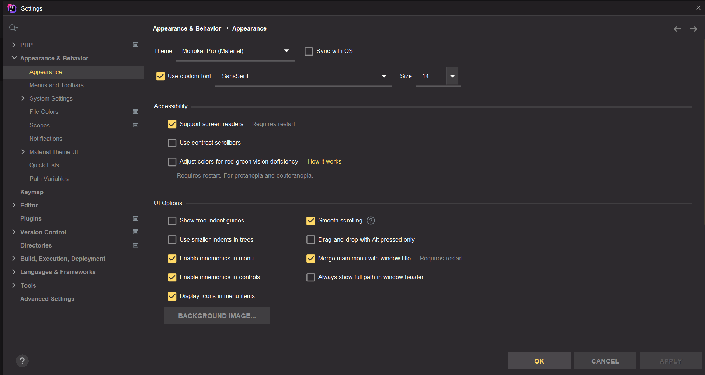

# Tarea 2.1 Presentación sobre un IDE

 Aquí vamos a mostrar la ejecución de código sobre distintos IDEs tanto IDEs online como son CodingBlocks y CodeChef en los cuales tienes que acceder a su página web para poder usarlos y IDEs de escritorio como es el PhpStorm de JetBrains.

## PHP STORM
___

### Ejecutando código HTML en PhpStorm y personalización del IDE.

+ Ejecución desde PHPStorm.

+ Ejecución código desde PHPStorm con la opción de visualizacion desde tu propio navegador.

.png)

+ Viendo el código fuente del código desde el navegador.

+ Ejecución código PHP en PHPStorm.
  
.png)

.png)

+ Código Fuente visto desde el navegador.

.png)

+ Configuración Personalizada de nuestro PHPStorm.

En la configuración tenemos definido un tema para la apariencia del IDE, la letra y su tamaño, en accesibilidad tenemos activada el soporte para lector de pantalla y en opciones de interfaz del usuario tenemos, tenemos activados los mnemotécnicos para que se puedan usar los atajos de teclado y el smooth scroll para efectos de transición entre diferentes secciones de una página, etcétera.
  

.png)

## CodingBlocks

___

### Ejecución código en CodingBlocks y personalización del IDE.

+ CodingBlocks nos permite exportar códigos que creemos en su IDE y también importarlos para su visualización y ejecución.

+ En este caso este IDE incluye atajos de teclado para intentar facilitar el uso del IDE a algunos usuarios, estos atajos no pueden ser configurados para que se utilizen en otras teclas y son escasos, sirviendo para ejecutar un código o volver a los ajustes por defecto, entre otras cosas.

+ También tiene algunas opciones para personalización del tema del IDE que se quedan cortas en comparación a otros IDEs de escritorio., estos ajustes son cambiar la fuente de la letra, su tamaño, la cantidad de espacios que se ponen cuando tabulas y la apariencia del código. En la captura también se puede ver la ejecución del código que una vez importado el archivo solo habría que darle a run.

+ Ejecución Código Java.

## CodeChef

___

### Ejecución código en CodeChef y personalización del IDE.

+ Lenguajes permitidos por CodeChef: hay una gran variedad de lenguajes y sus derivaciones como Python y CPython, pero no permiten lenguajes de marcas como XML y HTML.

.png)

+ Personalización IDE: Tiene opciones de personalización que permiten autocompletar texto, cambiar tamaño de la letra, el espaciado del tabulador y el Soft Wrap para que el texto real esté en la misma línea, pero parezca que está dividido en varias líneas.

.png)

+ Este IDE cuenta también con atajos de teclado, en este caso son muchos más pudiendo usarlos para casi cualquier cosa, como por ejemplo para importar un archivo, pantalla completa, información, ejecutar el código, etcétera.

.png) 

+ Ejecución Código HTML.

.png)

+ Ejecución Código Java.

.png)

+ Ejecución Código PHP.

.png)

+ Códigos usados

[Código Java](codigos/HolaMundo.java)
[Código Python](codigos/HolaMundo.py)
[Código PHP](codigos/holamundo.php)
[Código HTML](codigos/holamundo.html)